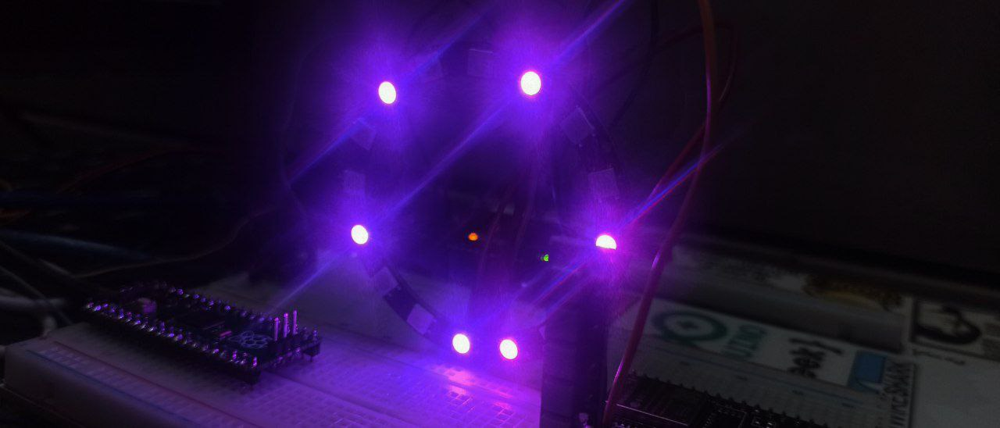
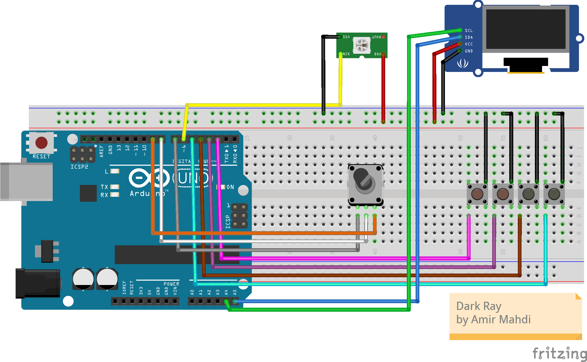

<h1 align="center">Dark-Ray</h1>
 🌈 DarkRay RGB Controller

An Arduino-powered RGB LED strip controller with **NeoPixel** support and an interactive **OLED display menu**, designed for smooth control using push buttons and a rotary encoder.

  

## 📦 Project Overview

**DarkRay RGB Controller** offers an intuitive interface to control LED colors and effects. Users can navigate through a menu system displayed on an OLED screen, allowing full customization of lighting patterns, speed, and brightness.

---

## 📚 Required Libraries

Before compiling the sketch, install the following libraries using the Arduino Library Manager:

- `Adafruit_GFX`
- `Adafruit_SSD1306`
- `Adafruit_NeoPixel`
- `Wire`

---

## 🔌 Hardware Connections

| Component            | Arduino Pin | Description                         |
|---------------------|-------------|-------------------------------------|
| 🔼 Button UP         | D2          | Navigate up in menu                 |
| 🔽 Button DOWN       | D3          | Navigate down in menu               |
| ✅ Button SELECT     | D4          | Confirm / enter a menu option       |
| ↩️ Button BACK       | D5          | Return / exit submenu               |
| 🖥️ OLED Display (I2C)| SDA → A4    | I2C Data Line                       |
|                     | SCL → A5    | I2C Clock Line                      |
| 🌈 NeoPixel Strip    | D6          | Data input for LED strip            |
| ⏱️ Rotary Encoder CLK| D7          | Clock pin                           |
| ⏲️ Rotary Encoder DT | D8          | Data pin                            |
| 🔘 Rotary Encoder SW | D9          | Encoder button                      |

> ⚠️ **Power Note:**  
> - Use a **separate 5V / 2A+ power supply** for the LED strip.  
> - Ensure **all GND connections are common** across power and data systems.

  

## ✨ Features

- Interactive **OLED menu**:
  - 🎨 Color picker  
  - 🔁 Effects: rainbow, blink, bounce, wave, fire, ice, and more  
  - ⚙️ Settings: speed and brightness  
  - ℹ️ About section with project info

- 📟 Dual control methods:
  - Push buttons (Up, Down, Select, Back)
  - Rotary encoder (rotate to scroll, press to select)

- 🌀 Smooth NeoPixel animations with dynamic menu updates
- 🧠 Button/encoder debounce logic included for accurate input

---

## ▶️ How to Use

1. Upload the sketch to an **Arduino Uno or Nano**.
2. Wire up the components as shown above.
3. Power on the system and wait for the welcome screen.
4. Use buttons or the encoder to explore and configure lighting effects.

---

## 👨‍💻 Developer Info

- 👤 **Developer:** AmirMahdi  
- 🛠 **Version:** v1.0 Pro  
- 🗓 **Release Date:** 2025-06-05  
- 🏁 **Made in:** Iran 🇮🇷

---

## 📝 Notes

- Rotary encoder and buttons are fully interchangeable.
- Effects run continuously with real-time updates for speed and brightness.
- Clean OLED UI ensures an engaging and responsive experience.

---

> 💡 **Thank you for using the DarkRay RGB Controller!**  
> Brighten your world — one pixel at a time 🌟
